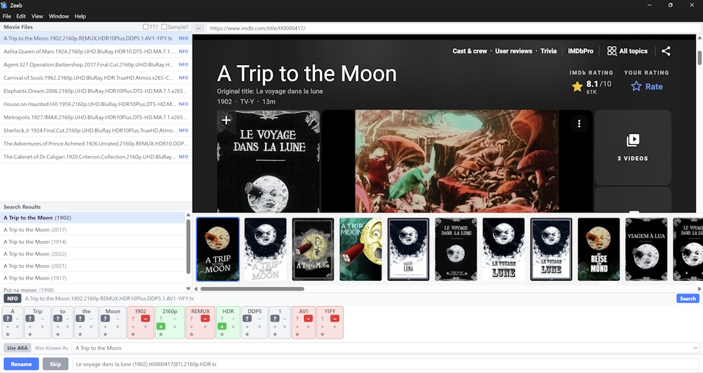
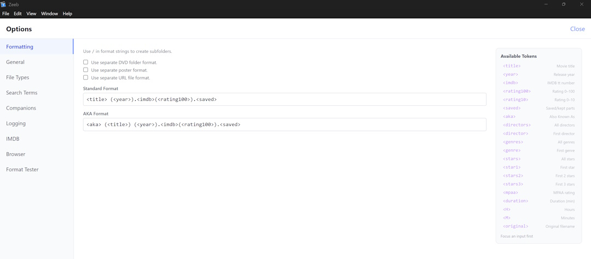

# Zeeb Movie Renamer

Batch movie file renamer with IMDB integration. Automatically parses filenames, searches IMDB, and renames files with customizable format patterns.

A complete rewrite of the original [Zeeb](https://sourceforge.net/projects/zeeb/) (Adobe Flex, v3.x) as a modern Electron + React desktop application.






## Download

Get the latest release from the [Releases page](https://github.com/jamison-wilde/zeeb/releases):

- **Windows:** Download the `.exe` installer (no admin rights needed)
- **macOS:** Download the `.dmg` disk image

No Node.js or other runtime is required — the installer is self-contained.

> **Note:** The app is not code-signed. On Windows, click "More info" → "Run anyway" on the SmartScreen prompt. On macOS, right-click → Open → confirm.

## Features

- Dual-renamer workflow with interleaved file processing
- IMDB integration via embedded webview
- TMDB poster browsing and saving
- NFO file parsing for auto-selection
- Configurable filename format patterns
- AKA (alternate title) support
- Subtitle and companion file renaming
- Selective undo with per-file results
- DVD folder detection and renaming
- URL/webloc bookmark file generation
- Format tester

## For developers
<details>

<summary><strong>Building from source</strong></summary>

Requires Node.js >= 20.

```bash
git clone https://github.com/jamison-wilde/zeeb.git
cd zeeb
npm install
npm start        # Run in development mode
npm test         # Run tests
npm run make     # Build installers for your platform
```
</details>

<details>
<summary><strong>Releasing</strong></summary>

1. Update `version` in `package.json`
2. Add release notes to `CHANGELOG.md` under `## [x.y.z] - YYYY-MM-DD`
3. Commit: `git commit -m "chore: bump version to x.y.z"`
4. Tag: `git tag vx.y.z`
5. Push: `git push origin main --tags`

CI automatically builds Windows and macOS installers and creates a GitHub Release.

</details>

GitHub Actions will automatically build Windows and macOS installers and create a GitHub Release.

## Credits

- Icon by Kristof Polleunis
- This product uses the TMDB API but is not endorsed or certified by TMDB.

## License

MIT
